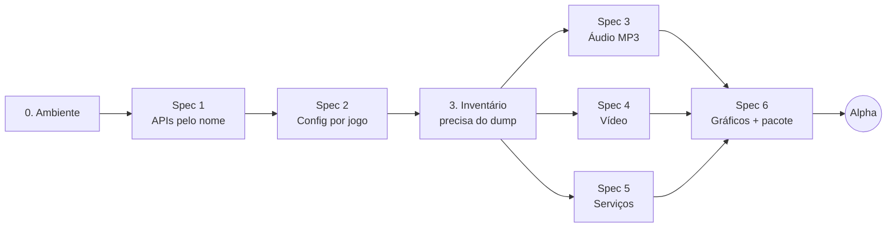

# gow3_pc — Roadmap até a versão Alpha

Port nativo de **God of War III Remastered** (PS4) para Windows, construído a partir do
[bbport / bloodborne_pc](https://github.com/Supermedo/bloodborne_pc).

| | |
|---|---|
| Repositório | [FelipePrado0/gow3_pc](https://github.com/FelipePrado0/gow3_pc) (fork de `Supermedo/bloodborne_pc`, branch `windows`) |
| Jogo alvo | God of War III Remastered, **CUSA01623**, versão **01.02** |
| Plataforma | Windows 10/11 64-bit, Vulkan 1.3 |
| Máquina de teste | AMD Radeon RX 6700 XT, Ryzen 5 5600X, 32 GB |
| Última atualização | 2026-10-09 (otimizações de GPU e lote de qualidade de vida) |

---

## Sumário

1. [Como o projeto funciona (versão simples)](#1-como-o-projeto-funciona-versão-simples)
2. [Definição da Alpha](#2-definição-da-alpha)
3. [Visão geral das etapas](#3-visão-geral-das-etapas)
4. [Etapas em detalhe](#4-etapas-em-detalhe)
5. [Riscos](#5-riscos)
6. [Pendências do usuário](#6-pendências-do-usuário)
7. [Depois da Alpha](#7-depois-da-alpha)
8. [Glossário](#8-glossário)
9. [Referências](#9-referências)

---

## 1. Como o projeto funciona (versão simples)

**Não é decompilação nem emulação completa.** O executável original do jogo (`eboot.bin`) roda
sem alterações, direto no processador do PC. Isso é possível porque o PS4 usa um processador
da mesma família do PC (x86-64, AMD).

O que o projeto faz é **imitar o sistema do PS4** em volta do jogo:

| Analogia web | No projeto | Onde está |
|---|---|---|
| App compilado sem código-fonte | Executável do jogo | `CUSA01623/eboot.bin` (dump do usuário) |
| Script de build/deploy | Preparação: lê o executável e gera uma imagem pronta para carregar | `scripts/prepare.py`, `scripts/link_modules.py` |
| Servidor que sobe o app | Loader: carrega a imagem na memória e inicia o jogo | `src/probe.c` |
| Implementação falsa das APIs do servidor | Runtime: reimplementa as APIs do PS4 usando o Windows | `src/runtime_*.c` |
| Adaptador de banco de dados | Tradutor de gráficos: comandos da GPU do PS4 → Vulkan | `gpu/` (núcleo do shadPS4) |
| Erro 404 com nome da rota | Quando o jogo chama uma API que não existe, o programa para e imprime `STOP: first unsupported PS4 import: <nome>` | `src/probe.c` |

O trabalho do port é, basicamente: **implementar cada API que o God of War III usa e o
port base não implementava, e corrigir os defeitos gráficos.**

---

## 2. Definição da Alpha

### Objetivo

God of War III Remastered abre pelo loader nativo, roda a cutscene de abertura e o prólogo
(batalha contra Poseidon) até o primeiro save, com som, vídeo e controle.

### Critérios de aceite

- [ ] O jogo chega ao menu principal e inicia um New Game.
- [ ] O prólogo roda até o primeiro save sem travar ou fechar.
- [ ] A cutscene de abertura toca com vídeo e som.
- [ ] Música, efeitos e vozes funcionam.
- [ ] Controle (via SDL) e teclado funcionam.
- [ ] Save grava e carrega após reiniciar o jogo.
- [ ] Média de 60 FPS ou mais a 1080p na RX 6700 XT.
- [ ] Sem texturas corrompidas nem tela branca no percurso.
- [ ] O log (`user/last_run.log`) não contém `STOP:` nem `Fault:` no percurso.

### Fora da Alpha

- Upscaling temporal (FSR 3/4, DLSS) e motion vectors.
- Launcher completo com todas as opções.
- Outras regiões (CUSA01715 etc.) e outras versões do jogo.
- Linux e Steam Deck.

---

## 3. Visão geral das etapas

| # | Etapa | Tipo | Precisa do jogo? | Depende de | Status |
|---|---|---|---|---|---|
| 0 | Preparar o ambiente | Setup | Não | — | ✅ Concluída |
| 1 | Reconhecer APIs pelo nome | **Spec 1** | Não | 0 | ✅ Concluída |
| 2 | Configuração por jogo + patches | **Spec 2** | Não | 1 | ✅ Concluída |
| 3 | Inventário de APIs faltantes | Diagnóstico | **Sim** | 1, 2 | ✅ Concluída |
| 4 | Áudio MP3 | **Spec 3** | Sim | 3 | ✅ Concluída |
| 5 | Vídeo das cutscenes | **Spec 4** | Sim | 3 | ✅ Concluída |
| 6 | Serviços do sistema que faltam | **Spec 5** | Sim | 3 | ✅ Concluída |
| 7 | Gráficos corretos + pacote | **Spec 6** | Sim | 4, 5, 6 | 🟨 Em andamento |

**Total: 6 specs** (podem virar 7–8 dependendo do inventário da etapa 3).

### O que já foi feito

| # | Entregue | Commit |
|---|---|---|
| 0 | MSYS2 CLANG64 instalado; `bash build.sh` gera `out/gow3-probe.exe` no Windows; branch `gow3` criada. Linha de base dos testes Python: 7 falhas que já existiam (testes só de Linux). | — |
| 1 | Imports gravados como `NID#biblioteca` (iguais em qualquer jogo), com libScePosix tratada como libkernel. Nova opção `--check-imports` lista o que falta sem rodar o jogo. | `c4617d2` |
| 2 | Perfil por jogo pelo `TITLE_ID`: GoW3 usa `patches/God_of_War_III_Remastered.xml` só na v01.02; DMEM e VBlank lidos das notas dos patches; patch de resolução substitui o Texture Fix; menu Insert com o nome do jogo. | `4589fb9` |
| 3 | Dump CUSA01623 v01.02 conferido. `--check-imports`: 387 imports, 45 faltando (35 chamados pelo jogo, 10 só pela libc/Fios2). Lista na seção da etapa 3. | `ea89783` |
| 4 (Spec 3) | MP3 no libSceAjm via FFmpeg (`src/runtime_mp3.c`): leitura do cabeçalho e dos metadados gapless (LAME/Xing, VBRI, FGH), `sceAjmDecMp3ParseFrame`, saída S16/S32/float. Teste `mp3-test`: a saída bate amostra por amostra com a decodificação do próprio FFmpeg. | `6f0a7a6` |
| 5 (Spec 4) | `sceVideodec` (H.264 para NV12) via FFmpeg (`src/runtime_videodec.c`): QueryResourceInfo, CreateDecoder, Decode, Flush, Reset, DeleteDecoder. Imagem maior que o buffer do jogo devolve erro em vez de estourar memória. Teste `videodec-test` com 6 quadros, incluindo B-frames. | `4a96c28` |
| 6 (Spec 5) | As 37 APIs restantes: diálogos de mensagem e save (barra de progresso fica aberta até o jogo fechar), PlayGo (tudo instalado), troféus (nada desbloqueado), barra de luz do controle, área segura da tela, argumentos do processo, `mmap`/`msync` anônimos, atributos de condição. A API desconhecida era `sceKernelStopUnloadModule` (confirmado pelo hash do nome); responde "módulo inexistente". Teste `services-test`. | `68409d4` |
| 7 (Spec 6) | GPU: as imagens copiadas de volta da GPU passam a esperar a GPU uma vez por envio, não uma vez por imagem (gameplay subiu de 2 para 52 a 60 FPS). Aviso `IT_SET_PREDICATION` registrado uma vez. Teclado funciona junto com o controle. | `08eadbc` |
| 7 (Spec 6a) | Lista de saves na tela (overlay): o jogo recebe a pasta escolhida ao salvar e carregar; "New save" e cancelar também funcionam. Teste no `services-test`. | `79d2f58` |
| 7 (Patches) | Os patches do shadPS4 eram de outra compilação do eboot v01.02. Endereços recalculados e conferidos byte a byte no dump (resolução +0x10 e -0x120, dados no mesmo lugar). Patch só é aplicado se o sha256 do `eboot.bin` for o do dump. 1440p testado a 60 FPS. | `e749951` |
| 7 (Patches) | 120 FPS portado: limite de FPS em `0x75dbe4` e leitura do FPS no cálculo de energia do golpe em `0x48ff1a` (constante 60,0). Acabou o jogo acelerado. | `d307830` |
| 7 (Spec 6b) | Launcher do God of War III: página Patches do jogo (resolução única e patches do XML), nome, banner e ícone do jogo, páginas do jogo original do port base escondidas, ícone na janela do jogo, atualização automática desligada, textos sem travessões. | `18a0d11`, `026147e` |
| 7 (Limpeza) | Código só do God of War III: saíram os patches, o hack de som, o modo de FPS, os efeitos, os cheats e as páginas do launcher do jogo original, além do launcher GTK de Linux. Prefixo antigo virou `gow3` (arquivos, binários `gow3-*`, variáveis `GOW3_*`, `gow3.ini`, `God of War III.exe`); ícone novo. Upscalers mantidos no código, desligados, para calibrar depois. Mods mantidos com layout genérico (`dvdroot_ps4`). | — |

`--check-imports` depois da spec 5: **0 faltando** (eram 45).

Primeira execução real (60 s, 2026-10-08): o jogo inicia sem `STOP:` nem `Fault:`; abre as portas de áudio, inicia o Ajm, cria o save, carrega os WADs das fases e envia comandos de GPU. O que aparece na tela ainda não foi verificado (início da spec 6).

| 7 (GPU) | Compilação assíncrona de shaders (`GOW3_ASYNC_SHADERS=1`), com workers, fila urgente e caches por worker. | `adde71e`, `cd9c70f` |
| 7 (GPU) | Correções portadas do fork eltutz: brilho estourado (aliasing de imagens) e sombras quebradas (depth/stencil sem uso). Blend MIN/MAX igual ao PS4. | `036d5d7`, `4676e1c`, `9c88add` |
| 7 (GPU) | Diagnóstico de esperas da GPU (`GOW3_PERF_DIAG=1`) e readback diferido (`GOW3_DEFERRED_READBACK=1`): esperas por quadro de 8 para 1 e FPS médio de 38,0 para 40,2 na cena de referência. | `d169080`, `7c1db31` |
| Extras | Multiplicador de orbes vermelhos e cheats com alternância no menu Insert. | `14b5c6d`, `c7d58c3` |

**Lote de 2026-10-09**

| Item | O que faz | Estado |
|---|---|---|
| Backup de saves | Cópia de `user/savedata` antes de cada abertura, 10 mantidas, restauração pelo launcher | Validado |
| Mods | Aviso de arquivos em conflito e presets de mods no launcher | Testes automáticos ok |
| Controles | Remapeamento de teclado e controle na página Controls, nomes PlayStation ou Xbox | Testes automáticos ok |
| Warmup paralelo | Loading do cache de 300 s para cerca de 70 s, mesmas pipelines (checkbox, ligada por padrão) | Validado no jogo |
| Barra de vida do inimigo | Hook na rotina de dano; barra verde centralizada com a vida em números, opção no menu Insert | Validado no jogo |
| Origem dos readbacks | Relatório por consumidor das esperas restantes (checkbox de diagnóstico) | Medido: 100% da espera é uma leitura da CPU por quadro, 11,6 ms |
| Proteção de páginas | Teste permanente da regressão da permissão inválida | Teste ok |

**Critérios da alpha (situação em 2026-10-08)**

| Critério | Situação |
|---|---|
| Menu e New Game | ✅ |
| Cutscene de abertura com vídeo e som | ✅ |
| Música, efeitos e vozes | ✅ |
| Controle e teclado | ✅ |
| Save grava e carrega após reiniciar | 🟨 lista de saves pronta, falta o teste do usuário |
| 60 FPS a 1080p na RX 6700 XT | ✅ (52 a 60; quedas só na primeira compilação de shaders) |
| Sem texturas corrompidas nem tela branca | 🟨 Texture Fix e leitura linear ligados; falta percorrer o prólogo inteiro |
| Log sem `STOP:` nem `Fault:` no percurso | ✅ nos testes feitos |
| Pacote zip que roda sem MSYS2 | ⬜ pendente |

**Pendências conhecidas**

- **Skip Intro** não foi portado: o código dele não bate com este eboot e ficou fora do XML.
- **120 FPS:** o jogo limita o tempo de cada quadro a 1/FPS alvo. Abaixo de 120 FPS ele roda em câmera lenta (no PS4 acontece o mesmo abaixo de 60). Nas cenas pesadas a RX 6700 XT fica entre 52 e 65 FPS, então o patch só vale onde 120 se sustenta.
- **Inicialização:** com o cache cheio (5226 pipelines) o loading serial leva de 300 a 400 s. O warmup paralelo leva cerca de 70 s e vem ligado por padrão no launcher.
- **Desempenho real:** a cena de referência roda a cerca de 40 FPS com o patch de 120 FPS; ainda há cerca de 11,5 ms por quadro esperando readbacks.
- **Saves de teste:** existem 10 saves `SD-2610080631xx` criados antes da lista de saves; podem ser apagados.
- **Predicação da GPU** (`IT_SET_PREDICATION`) continua sem implementação, como no shadPS4.
- **Linux:** o `build.sh` do Linux recebeu os testes novos e o FFmpeg no runtime, mas não foi compilado.
- **Menu Insert:** textos ainda em russo e inglês.
- **Configurações antigas:** as do port base não são migradas; os nomes novos são `gow3.ini` e `%APPDATA%\gow3-launcher`.
- **Upscalers temporais:** FSR 3/4, DLSS, TAA e vetores de movimento seguem no código, desligados; falta mapear o quadro do God of War III (cor da cena, profundidade, constantes da câmera).

- Os testes em C (`test_runtime.c`, `test_content.c`, `test_sema.c`) não compilam no Windows pelo `build.sh`. As chaves foram convertidas, mas esses testes ainda não rodaram.
- Zerar o `--check-imports` não garante que o jogo abre: travamentos de execução e defeitos gráficos entram na spec 6.

Legenda de status: ⬜ Pendente · 🟨 Em andamento · ✅ Concluída · ⛔ Bloqueada

### Fluxo de cada spec

1. Spec escrita (objetivo, contrato, casos de erro, arquivos, critérios de aceite).
2. **Aprovação do usuário** (único ponto de parada obrigatório).
3. Testes escritos antes do código, quando a lógica não é trivial.
4. Implementação.
5. Validação: testes automáticos e execução real do jogo.
6. Commit e atualização do status nesta página.

---

## 4. Etapas em detalhe

### Etapa 0 — Preparar o ambiente

**O que é:** instalar o compilador e confirmar que o projeto, ainda sem mudanças, compila.

**Passos**

1. Instalar MSYS2: `winget install MSYS2.MSYS2`.
2. No shell **MSYS2 CLANG64**, instalar os pacotes listados em
   [packaging/windows/README.md](../../packaging/windows/README.md).
3. `git submodule update --init --recursive` (já feito no clone).
4. `bash build.sh` e confirmar que existem `out/gow3-probe.exe` e `out/gow3-gpu-capabilities.exe`.
5. `python -m unittest discover -s tests` e anotar a linha de base (o que já passa ou falha).
6. Criar a branch `gow3`.

**Pronto quando:** o build termina sem erro e a linha de base dos testes está registrada.

---

### Spec 1 — Reconhecer APIs pelo nome

**Problema:** o runtime identifica cada API do PS4 por um nome que inclui códigos internos do
dump do jogo original do port base (ex.: `"bzQExy189ZI#q#q"`). No God of War III esses códigos são outros e
nenhuma API seria encontrada.

**Solução:** trocar para uma chave canônica `NID#nomeDaBiblioteca` (ex.:
`bzQExy189ZI#libc`), que é igual em qualquer jogo. Adicionar um comando que lista as APIs
faltantes sem rodar o jogo.

**Arquivos afetados**

- `scripts/link_modules.py` — gerar nomes canônicos na imagem.
- `src/import_names.inc` — reescrever as ~750 entradas na chave canônica.
- `src/runtime.c`, `src/runtime_memory.c` — comparações diretas com nomes antigos.
- `src/probe.c` — nova opção `--check-imports`.
- `tests/` — novo teste da chave canônica.

**Requisitos**

- O sistema deve sempre resolver uma API pela chave canônica, sem depender dos códigos locais
  do dump.
- Quando `--check-imports` for usado, o sistema deve listar todas as APIs sem implementação e
  sair com código diferente de 0 se faltar alguma.
- Quando o jogo chamar uma API sem implementação, o sistema deve parar com `STOP:` e o nome.
  Nunca deve fingir sucesso.

**Critérios de aceite**

- [ ] Teste prova que a mesma API resolve igual com códigos locais diferentes.
- [ ] Testes existentes continuam na mesma linha de base da etapa 0.
- [ ] `gow3-probe.exe out/boot-linked.bin --check-imports` imprime a lista e o código de saída.

---

### Spec 2 — Configuração por jogo + patches

**Problema:** nome, ID, versão e patches do jogo original do port base estavam fixos no código.

**Solução:** ler título e ID do `param.sfo` do jogo, aceitar `CUSA01623`, aplicar patches
conforme o jogo e a versão.

**Arquivos afetados**

- `run.py` — pasta padrão do jogo e mensagens.
- `scripts/patches.py` — validação de patches por ID e versão do jogo.
- `src/probe.c`, `gpu/shim/gow3gpu.cpp`, `gpu/shim/gow3_overlay.cpp` — título da janela e do menu.
- `patches/God_of_War_III_Remastered.xml` — novo, com os patches de resolução (720p, 1440p,
  4K) e 120 FPS da comunidade ([ps4_cheats#145](https://github.com/shadps4-emu/ps4_cheats/pull/145)).
- `tests/test_patches.py` — novos casos.

**Requisitos**

- Quando o jogo não for CUSA01623 v01.02, o sistema deve recusar os patches do God of War III
  e registrar o motivo no log.
- Quando um patch de resolução acima de 1080p estiver ativo, o sistema deve reservar a memória
  extra necessária (`GOW3_DMEM_MB`).

**Critérios de aceite**

- [ ] Testes cobrem jogo certo, jogo errado e versão errada.
- [ ] A janela e o menu (Insert) mostram o título lido do jogo.

---

### Etapa 3 — Inventário de APIs faltantes

**O que é:** primeiro contato com o jogo. Não muda código.

**Passos**

1. Colocar o dump em `../CUSA01623` (base + update 01.02 mesclados).
2. Rodar a preparação (`run.py`, ou `prepare.py` e `link_modules.py` direto).
3. Rodar `--check-imports` e salvar a lista.
4. Tentar iniciar o jogo e anotar o primeiro `STOP:`.
5. Atualizar as specs 3, 4 e 5 com a lista real.

**Pronto quando:** existe a lista completa de APIs faltantes, agrupada por spec.

**Resultado (2026-10-08, `--check-imports` no dump v01.02):** 387 imports, **45 sem implementação**.

| Biblioteca | Faltam | Funções | Spec |
|---|---|---|---|
| libSceVideodec | 6 | QueryResourceInfo, CreateDecoder, Decode, Flush, Reset, DeleteDecoder | 4 |
| libSceAjm | 2 | DecMp3ParseFrame, BatchJobRunSplitBufferRa | 3 |
| libSceSaveDataDialog | 5 | IsReadyToDisplay, GetStatus, GetResult, Close, ProgressBarSetValue | 5 |
| libSceMsgDialog | 2 | Close, ProgressBarSetValue | 5 |
| libScePlayGo | 5 | GetProgress, SetToDoList, GetInstallSpeed, Close, Terminate | 5 |
| libSceNpTrophy | 4 | GetTrophyUnlockState, AbortHandle, DestroyHandle, DestroyContext | 5 |
| libSceSystemService | 2 | GetDisplaySafeAreaInfo, DisableMusicPlayer | 5 |
| libScePad | 2 | SetLightBar, ResetLightBar | 5 |
| libSceAudioOut | 1 | Outputs | 5 |
| libkernel | 16 | getargc/getargv, mmap/msync, Mlock, GetTscFrequency, GetModuleInfoFromAddr e 9 sem nome conhecido | 5 |

Comando: `gow3-probe.exe out/boot-linked.bin --app0 <jogo> --check-imports` (sai com 1 se faltar algo).

**APIs esperadas antes do inventário** (de um log do jogo no shadPS4):

| API | Coberta hoje? | Spec |
|---|---|---|
| AJM ATRAC9 (áudio) | Sim | — |
| AJM MP3 (áudio) | Não | 3 |
| `sceVideodec` (vídeo H.264) | Não | 4 |
| MsgDialog, SaveDataDialog | Não | 5 |
| NpScoreRanking, NpTus, NpUtility (PSN) | Não | 5 |
| DiscMap | Não | 5 |
| PlayGo, NpTrophy, Http, Ssl, Rtc | Sim | — |

---

### Spec 3 — Áudio MP3

**Problema:** o decodificador de áudio só suporta ATRAC9. O God of War III também usa MP3 e
hoje o jogo para em `STOP: Ajm codec 0 (0=MP3, 2=AAC) is not implemented`
([src/runtime_ajm.c](../../src/runtime_ajm.c)).

**Solução:** decodificar MP3 com o FFmpeg, que já faz parte do build.

**Arquivos afetados:** `src/runtime_ajm.c`, build (`build.sh`/CMake) se for preciso ligar o
FFmpeg ao runtime, e um novo teste com um MP3 pequeno gerado.

**Requisitos**

- Quando o jogo enviar um quadro MP3 válido, o sistema deve devolver as amostras PCM no
  formato que o jogo pediu.
- Se o stream MP3 for inválido, o sistema deve devolver o código de erro do PS4, sem fechar o
  jogo.

**Critérios de aceite**

- [ ] Teste decodifica um MP3 de referência e confere o número de amostras.
- [ ] No jogo, música de menu e vozes tocam sem chiado.

---

### Spec 4 — Vídeo das cutscenes

**Problema:** o port base só tinha `sceAvPlayer`. O God of War III usa `sceVideodec`, um
decodificador mais baixo nível que não existe no runtime.

**Solução:** adaptar a implementação do shadPS4 (baseada em FFmpeg H.264) para o runtime.

**Arquivos afetados:** novo `src/runtime_videodec.c`, `src/runtime.c` (registro), build e testes.

**Requisitos**

- Quando o jogo enviar dados H.264 válidos, o sistema deve devolver o quadro decodificado no
  formato e na memória que o jogo indicou.
- Se o vídeo for inválido, o sistema deve devolver o código de erro do PS4, sem fechar o jogo.
- Quando o jogo fechar o decodificador, o sistema deve liberar toda a memória dele.

**Critérios de aceite**

- [ ] Teste decodifica um H.264 de referência.
- [ ] A cutscene de abertura toca inteira, sincronizada com o som.

---

### Spec 5 — Serviços do sistema que faltam

**Problema:** diálogos do sistema, serviços da PSN e outras APIs listadas na etapa 3.

**Solução:** implementar cada uma com comportamento explícito. Exemplos: PSN responde
"usuário não conectado", diálogo de save confirma automaticamente.

**Arquivos afetados:** `src/runtime_services.c`, `src/runtime_savedata.c` e outros conforme o
inventário.

**Requisitos**

- O sistema deve sempre devolver o mesmo código de erro que um PS4 sem PSN devolveria.
  Nunca deve fingir que a PSN está conectada.
- Quando o jogo abrir um diálogo do sistema, o sistema deve concluí-lo com o resultado
  documentado na spec e registrar no log.

**Critérios de aceite**

- [ ] O jogo passa do menu para o gameplay sem `STOP:`.
- [ ] Save e load funcionam após reiniciar o jogo.

> Se o inventário revelar algo grande (ex.: um sistema inteiro novo), esta spec é dividida.

---

### Spec 6 — Gráficos corretos + pacote

**Problema:** o tradutor de gráficos herda defeitos conhecidos do shadPS4 no God of War III:
texturas corrompidas, iluminação queimada, tela branca e travadas ao entrar em áreas novas.
As otimizações herdadas do port base foram feitas para outro jogo e podem não servir.

**Solução, em ordem**

1. Rodar com o modo mais seguro: `GOW3_READBACK_LINEAR=1`, `GOW3_UPSCALER=none`,
   `GOW3_DRAW_PIPE=0` e otimizações desligadas via `GOW3_TOGGLE_FILE`.
2. Portar as correções do fork [brunoShadPs4](https://github.com/serbru20066666/brunoShadPs4)
   (iluminação, MSAA, espera CPU/GPU no fim do quadro).
3. Religar as otimizações do gow3 uma a uma e medir FPS.
4. Gerar o pacote: zip com `run.py --play` e seleção da pasta do jogo.

**Arquivos afetados:** `gpu/shadps4/video_core/...` (definidos durante a investigação),
`packaging/windows/package.sh`.

**Requisitos**

- Enquanto uma otimização do gow3 causar erro visual no God of War III, o sistema deve
  mantê-la desligada por padrão para este jogo.
- O sistema deve sempre manter 60 FPS ou mais a 1080p na máquina de teste.

**Critérios de aceite**

- [ ] Percurso da alpha sem texturas corrompidas nem tela branca (comparado por capturas).
- [ ] `GOW3_FRAME_STATS=1` mostra média de 60 FPS ou mais.
- [ ] O zip roda numa pasta limpa, sem MSYS2 instalado.

> Esta é a spec mais incerta. Pode ser dividida por tipo de defeito quando eles aparecerem.

---

## 5. Riscos

| Risco | Impacto | Mitigação |
|---|---|---|
| Defeitos gráficos sem solução conhecida no shadPS4 | Alto | Portar correções do brunoShadPs4; acompanhar o upstream do shadPS4 |
| Inventário revela APIs grandes não previstas | Médio | Dividir a spec 5; reaproveitar implementações do shadPS4 |
| O upstream (bloodborne_pc) muda todo dia | Médio | Remote `upstream`, merge periódico da branch `windows` |
| Código C de baixo nível difícil de depurar | Médio | Logs `STOP:`/`Fault:`, `GOW3_PAD_RECORD`/`GOW3_PAD_REPLAY` para repetir percursos |
| Licença | Baixo | Manter GPL-2.0 e os créditos; nunca distribuir arquivos do jogo |

---

## 6. Pendências do usuário

| Pendência | Necessária a partir de |
|---|---|
| Autorizar a instalação do MSYS2 | Etapa 0 |
| Aprovar cada spec antes da implementação | Specs 1 a 6 |
| Dump próprio de CUSA01623 v01.02 (base + update) em `../CUSA01623` | Etapa 3 |
| Testar o percurso no jogo e relatar o que viu | Specs 3 a 6 |

---

## 7. Depois da Alpha

Ideias para versões seguintes, sem compromisso:

- **Beta:** jogo completo do início ao fim; outras regiões (CUSA01715).
- Launcher completo, com idiomas e opções, reaproveitando o do gow3.
- Upscaling temporal (FSR 3/4). O God of War III tem motion blur por objeto, então
  **provavelmente** já gera vetores de movimento, o que facilitaria. Precisa ser confirmado
  com captura de quadro.
- DLSS para placas NVIDIA.

---

## 8. Glossário

| Termo | Significado simples |
|---|---|
| **eboot.bin** | O executável do jogo de PS4 |
| **Dump** | Cópia dos arquivos do jogo extraída de um PS4 próprio |
| **CUSA01623** | Código da versão americana do God of War III Remastered |
| **HLE / runtime** | Reimplementação das APIs do PS4 usando o Windows |
| **Import / NID** | Uma API do sistema que o jogo chama; o NID é o ID dela |
| **Loader** | Programa que carrega o jogo na memória e o inicia |
| **shadPS4** | Emulador de PS4 open source; o projeto usa a parte de gráficos dele |
| **Vulkan** | API gráfica moderna usada para desenhar na placa de vídeo do PC |
| **AJM** | Sistema de decodificação de áudio do PS4 |
| **ATRAC9 / MP3** | Formatos de áudio usados pelo jogo |
| **sceVideodec** | Decodificador de vídeo do PS4 (formato H.264) |
| **Patch** | Alteração em endereços do jogo para mudar resolução ou FPS |
| **FSR / DLSS** | Técnicas que renderizam em resolução menor e ampliam a imagem com qualidade |

---

## 9. Referências

- [bloodborne_pc (Supermedo)](https://github.com/Supermedo/bloodborne_pc), base deste fork.
- [bbport (deadinside28)](https://github.com/deadinside28/bloodborne_pc), port original para Linux.
- [shadPS4](https://github.com/shadps4-emu/shadPS4), origem do tradutor de gráficos.
- Compatibilidade do God of War III no shadPS4:
  [#416 (Windows)](https://github.com/shadps4-compatibility/shadps4-game-compatibility/issues/416),
  [#423 (Linux)](https://github.com/shadps4-compatibility/shadps4-game-compatibility/issues/423).
- [brunoShadPs4 0.21.0](https://github.com/serbru20066666/brunoShadPs4/releases/tag/0.21.0),
  fork com correções específicas do God of War III.
- [ps4_cheats#145](https://github.com/shadps4-emu/ps4_cheats/pull/145), patches de resolução e
  120 FPS.
- Documentos internos do gow3: [upscaler](../upscaler.md), [parallel GPU](../parallel_gpu.md),
  [motion vectors](../motion_vectors.md), [Windows](../../packaging/windows/README.md).
